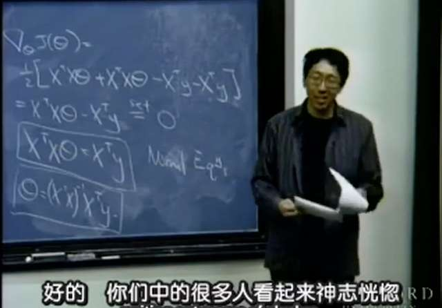

# pytorch dataloader之從入門到入魔(CV方向篇) #


##  torch version ##

- torch  (1.1.0)
- torchvision  (0.2.1)

****
## 炼丹学徒(调包侠)的自我修养 ##

作为新时代的入坑的计算机视觉工程师，假设你已经知道怎么把CNN跑起来~~，可以什么都不懂什么都不管，遇事直接怼CNN~~。


不过该有的修养你还是要有，比如要知道最基本的图像分类任务，数据文件格式和数据目录结构是怎样的。以喜闻乐见的猫狗大战数据集为例:
```python
    """A generic data loader where the images are arranged in this way: ::

        root/dog/xxx.png
        root/dog/xxy.png
        root/dog/xxz.png
        ……

        root/cat/123.png
        root/cat/nsdf3.png
        root/cat/asd932_.png
        ……
    """
```
只要是类似**root/class_name/×××{'.jpg', '.jpeg', '.png', '.ppm', '.bmp', '.pgm', '.tif', '.tiff', '.webp'}**这样的文件结构的数据集，都可以直接无脑调用```torchvison```中已经提供好的```datasets.ImageFolder```,非常便捷完成这个数据集的dataloader定义:
```python
from torchvision import datasets, transforms
data_transforms = transforms.Compose([
                transforms.ColorJitter(hue=0.2),
                transforms.Resize((224,224)),
                transforms.RandomHorizontalFlip(),
                transforms.RandomVerticalFlip(),
                transforms.ToTensor(),
                transforms.Normalize(mean,std)
                ])
image_datasets = datasets.ImageFolder(root,data_transforms)
dataloaders = torch.utils.data.DataLoader(image_datasets, batch_size = batch_size, shuffle = True, num_workers=0)

```
是不是觉得只需要掌握上边这种调用```torchvison```的方法就能天下我有，什么图像分类任务都不怕了？只能说这些想法实在是**_too young too simple,sometime naive_**。

## 要准备放弃治疗吗?

还是以上述的猫狗大战数据集为例，现在将数据场景稍微改变了一下: 分类还是那个分类，只是目录结构不再是原来的二层，而是三层(甚至可能更多)。比如多了一个**"breed"**(品种)的标记，结构大概是下面这样子的:
```python
    """A generic data loader where the images are arranged in this way: ::

        root/dog/breed_DOG_a/xxx.png
        root/dog/breed_DOG_a/xxy.png
        root/dog/breed_DOG_b/xxz.png
        ……

        root/cat/breed_CAT_a/123.png
        root/cat/breed_CAT_d/nsdf3.png
        root/cat/breed_CAT_b/asd932_.png
        ……
    """
```
虽然我们的目标还是只进行猫狗这两个大类的分类，但可能基于某些原因，我们并不是将所有breed的猫和狗都加入训练集/测试集，此外就是最终评价模型的时候希望能以breed为单位显示相应的metrics，那我们该如何整理数据让其顺利加入训练？

这个问题当然难不倒朴实无华且枯燥的炼丹学徒，他们灵机一动，将整个数据集完整复制一份**{origin_dataset}**→**{new_copy_dataset}**，然后将复制的那份数据从三层结构调整到二层结构，验证的时候再用原来的数据集不就好了？如果他们有项目leader，一定会感到很欣慰，然后只能用关怀智障的眼神盯着他们——开喷：所以就为了个不足道的原因将整个数据集再复制多一次?!你不嫌累我也嫌你这样操作太占用硬盘空间了！

当然，这并非是问题的全部，一般来说我们为了验证模型的准确性，都会要求做K-FOLDs交叉验证，于是，交叉验证的数据集怎么来？朴实无华的炼丹学徒坚守```torchvison.datasets.folder.ImageFolder```，永不为奴，会跟你说:一把梭，每一FOLD复制一次整体数据集再手工划分不就好了嘛！

千万不要以为我在开玩笑，我是见过真有这样做的。

顺利的炼丹都是相似的，不顺的炼丹各有各的不顺，作为学徒，你确定只会当个```torchvison.datasets```的调包侠就能出师然后行走江湖了吗？


## 初识torchvision中的datasets.ImageFolder ##

既然我们已经知道```datasets.ImageFolder```只能适用于新手村那样任务是白给的场景，想要摆脱它的限制，就先要对它的构造有一定的认识，喜闻乐见的趴源代码环节要来了(*毕竟做计算机视觉不是别人请你吃饭——饭菜直接给你端上来可以不管庖厨的事务。不要以为世界这么美好，不会查看源代码也不会自己开发改进版的工具的情况下有人什么都帮你做好了，就差你来进行调包训练？真的万事俱备了还要你作甚*)。下面是```torchvision.dataset.folder```中比较核心的代码段:
```python
def make_dataset(dir, class_to_idx, extensions=None, is_valid_file=None):
    images = []
    dir = os.path.expanduser(dir)
    if not ((extensions is None) ^ (is_valid_file is None)):
        raise ValueError("Both extensions and is_valid_file cannot be None or not None at the same time")
    if extensions is not None:
        def is_valid_file(x):
            return has_file_allowed_extension(x, extensions)
    for target in sorted(class_to_idx.keys()):
        d = os.path.join(dir, target)
        if not os.path.isdir(d):
            continue
        for root, _, fnames in sorted(os.walk(d)):
            for fname in sorted(fnames):
                path = os.path.join(root, fname)
                if is_valid_file(path):
                    item = (path, class_to_idx[target])
                    images.append(item)

    return images

class DatasetFolder(VisionDataset):
    """A generic data loader where the samples are arranged in this way: ::

        root/class_x/xxx.ext
        root/class_x/xxy.ext
        root/class_x/xxz.ext

        root/class_y/123.ext
        root/class_y/nsdf3.ext
        root/class_y/asd932_.ext

    Args:
        root (string): Root directory path.
        loader (callable): A function to load a sample given its path.
        extensions (tuple[string]): A list of allowed extensions.
            both extensions and is_valid_file should not be passed.
        transform (callable, optional): A function/transform that takes in
            a sample and returns a transformed version.
            E.g, ``transforms.RandomCrop`` for images.
        target_transform (callable, optional): A function/transform that takes
            in the target and transforms it.
        is_valid_file (callable, optional): A function that takes path of an Image file
            and check if the file is a valid_file (used to check of corrupt files)
            both extensions and is_valid_file should not be passed.

     Attributes:
        classes (list): List of the class names.
        class_to_idx (dict): Dict with items (class_name, class_index).
        samples (list): List of (sample path, class_index) tuples
        targets (list): The class_index value for each image in the dataset
    """

    def __init__(self, root, loader, extensions=None, transform=None, target_transform=None, is_valid_file=None):
        super(DatasetFolder, self).__init__(root)
        self.transform = transform
        self.target_transform = target_transform
        classes, class_to_idx = self._find_classes(self.root)
        samples = make_dataset(self.root, class_to_idx, extensions, is_valid_file)
        if len(samples) == 0:
            raise (RuntimeError("Found 0 files in subfolders of: " + self.root + "\n"
                                "Supported extensions are: " + ",".join(extensions)))

        self.loader = loader
        self.extensions = extensions

        self.classes = classes
        self.class_to_idx = class_to_idx
        self.samples = samples
        self.targets = [s[1] for s in samples]

    def _find_classes(self, dir):
        """
        Finds the class folders in a dataset.

        Args:
            dir (string): Root directory path.

        Returns:
            tuple: (classes, class_to_idx) where classes are relative to (dir), and class_to_idx is a dictionary.

        Ensures:
            No class is a subdirectory of another.
        """
        if sys.version_info >= (3, 5):
            # Faster and available in Python 3.5 and above
            classes = [d.name for d in os.scandir(dir) if d.is_dir()]
        else:
            classes = [d for d in os.listdir(dir) if os.path.isdir(os.path.join(dir, d))]
        classes.sort()
        class_to_idx = {classes[i]: i for i in range(len(classes))}
        return classes, class_to_idx

    def __getitem__(self, index):
        """
        Args:
            index (int): Index

        Returns:
            tuple: (sample, target) where target is class_index of the target class.
        """
        path, target = self.samples[index]
        sample = self.loader(path)
        if self.transform is not None:
            sample = self.transform(sample)
        if self.target_transform is not None:
            target = self.target_transform(target)

        return sample, target

    def __len__(self):
        return len(self.samples)


IMG_EXTENSIONS = ('.jpg', '.jpeg', '.png', '.ppm', '.bmp', '.pgm', '.tif', '.tiff', '.webp')


class ImageFolder(DatasetFolder):

    def __init__(self, root, transform=None, target_transform=None,
                 loader=default_loader, is_valid_file=None):
        super(ImageFolder, self).__init__(root, loader, IMG_EXTENSIONS if is_valid_file is None else None,
                                          transform=transform,
                                          target_transform=target_transform,
                                          is_valid_file=is_valid_file)
        self.imgs = self.samples
```
需要重点留意一下```make_dataset```方法的定义，它本质上就是用Python自带的```os.walk(root)```的方法来遍历二级目录下有文件，并将符合的文件塞进名为image的列表中，然后将其返回。接着就是类```DatasetFolder(VisionDataset)```的```find_classes```方法，生成label→class_to_idx的映射字典,以猫狗大战的数据集为例就是**{'cat':0,'dog':1}**。之后```ImageFolder```类是继承```DatasetFolder```的，而```DatasetFolder```是继承```VisionDataset```的。最后，我们来看一下```VisionDataset```的定义：

```python
class VisionDataset(data.Dataset):
    _repr_indent = 4

    def __init__(self, root, transforms=None, transform=None, target_transform=None):
        if isinstance(root, torch._six.string_classes):
            root = os.path.expanduser(root)
        self.root = root

        has_transforms = transforms is not None
        has_separate_transform = transform is not None or target_transform is not None
        if has_transforms and has_separate_transform:
            raise ValueError("Only transforms or transform/target_transform can "
                             "be passed as argument")

        # for backwards-compatibility
        self.transform = transform
        self.target_transform = target_transform

        if has_separate_transform:
            transforms = StandardTransform(transform, target_transform)
        self.transforms = transforms

    def __getitem__(self, index):
        raise NotImplementedError

    def __len__(self):
        raise NotImplementedError

    def __repr__(self):
        head = "Dataset " + self.__class__.__name__
        body = ["Number of datapoints: {}".format(self.__len__())]
        if self.root is not None:
            body.append("Root location: {}".format(self.root))
        body += self.extra_repr().splitlines()
        if self.transforms is not None:
            body += [repr(self.transforms)]
        lines = [head] + [" " * self._repr_indent + line for line in body]
        return '\n'.join(lines)

    def _format_transform_repr(self, transform, head):
        lines = transform.__repr__().splitlines()
        return (["{}{}".format(head, lines[0])] +
                ["{}{}".format(" " * len(head), line) for line in lines[1:]])

    def extra_repr(self):
        return ""
```



是不是看得怀疑人生了，尤其是这样绕来绕去的，不过好消息是，其实你就算没耐性仔细读```VisionDataset```的代码，你至少只需要了解到，```VisionDataset```类是继承```torch.utils.data.Dataset```就足够了，因为这个类，才是我们从入门到入魔的关键。


## 找到你了，关键的类torch.utils.data.Dataset ##
恭喜能坚持读到这一段的炼丹学徒，你们总算可以说：_终于找到你，还好没放弃_

> **torch.utils.data.dataset.py**

等等，似乎高兴得有些早，因为它的代码是这样子的:

```python
class Dataset(object):
    """An abstract class representing a Dataset.

    All other datasets should subclass it. All subclasses should override
    ``__len__``, that provides the size of the dataset, and ``__getitem__``,
    supporting integer indexing in range from 0 to len(self) exclusive.
    """

    def __getitem__(self, index):
        raise NotImplementedError

    def __len__(self):
        raise NotImplementedError

    def __add__(self, other):
        return ConcatDataset([self, other])
```
这是什么鬼? 是代码界的大道至简，无码胜有码吗?

其实这就是pytorch(或者说其他框架)关于dataset的真相，核心就是有固定长度 ``__len__(self)``,且能迭代其中的元素```__getitem__(self, index)```。

通俗地说一下什么是固定长度和可迭代其中的元素，以```LST = ['a','b','c','d']```这个列表为例:
这个列表当前的长度是4(其实这里用列表不是很合适，因为在Python中列表是可修改的，长度可能会发生变化，更适合的例子是元组)，里面每一个元素其实都可以使用迭代器提取出来，常见的做法就是用下标:

```python
In : LST = ['a','b','c','d']

In : LST[0],LST[2]

Out : ('a', 'c')
```

但更常见的做法，是以for循环的方式提取迭代：
```python
for i,g in enumerate(LST):
    print(i,g)

Out :
0 a
1 b
2 c
3 d
```
也就是说，只要我们造出类似的对象(有固定的长度和可迭代的元素)，定义``__len__(self)``和```__getitem__(self, index)```的方法就可以了。

### 回头看一下torchvision.datasets.folder.py其他方法 ###

```python
def pil_loader(path):
    # open path as file to avoid ResourceWarning (https://github.com/python-pillow/Pillow/issues/835)
    with open(path, 'rb') as f:
        img = Image.open(f)
        return img.convert('RGB')


def accimage_loader(path):
    import accimage
    try:
        return accimage.Image(path)
    except IOError:
        # Potentially a decoding problem, fall back to PIL.Image
        return pil_loader(path)


def default_loader(path):
    from torchvision import get_image_backend
    if get_image_backend() == 'accimage':
        return accimage_loader(path)
    else:
        return pil_loader(path)
```
通过```default_loader```指定具体的加载数据方法(其实就是简单的加载图像而已),然后在```DatasetFolder```中的```__getitem__()```方法中明确这个loader:
```python
    def __getitem__(self, index):
        """
        Args:
            index (int): Index

        Returns:
            tuple: (sample, target) where target is class_index of the target class.
        """
        path, target = self.samples[index]
        sample = self.loader(path)
        if self.transform is not None:
            sample = self.transform(sample)
        if self.target_transform is not None:
            target = self.target_transform(target)

        return sample, target

    def __len__(self):
        return len(self.samples)
```
以**index**作为传参,先确定加载的**path**,然后使用``self.loader(path)``确定**sample**,如果有``transforms``就对其进行transform。就这样，一个真**·**朴实无华的dataloader就这样被创造出来了。

## 简单小结 ##
1. 要定义data source

2. 要定义具体的读取数据方法(一般是``PIL.Image.open()``用加载图片)

3. 在开发的loader中的``__getitem__(self, index)``函数，要注意label的获取+返回方法

4. 确定数据打乱方式shuffle 

### 定义data source ###
官方的方法是用```os.walk(root)```的方法结合```os.path.join(root, fname)```，将所有数据对象塞进一个list里。但在Python中要获取文件列表的方法多得是，只要你把数据清洗这一步预先做好，就可以用```os.listdir()```。如果想突破root目录的限制(比如我们的数据集超过3层甚至都不在同一个根目录)，可以活用```glob.glob()```将他们一次过加载进来。甚至也可以指定具体的辅助的list对原始数据集进行筛选，这样就可以在K-FOLDs交叉验证时不需要重复生成数据，例如:
```python
import glob
import os
def make_dataset(dir, class_to_idx, breed_class,extensions=['jpg', 'jpeg', 'png', 'ppm', 'bmp', 'pgm', 'tif', 'tiff', 'webp']):
    images = []
    dir = os.path.expanduser(dir)
    if not (os.os.path.isdir):
        raise ValueError("Make sure the path of root dir is correct!")

    for target in sorted(class_to_idx.keys()):
        d = os.path.join(dir, target,breed_class)
        if not os.path.isdir(d):
            continue
        tmp_list = glob.glob(os.path.join(d,"*.*"))
        for imgfile in sorted(tmp_list):
           if os.path.basename(imgfile).split('.')[-1]) in extensions:
               images.append(imgfiles)

    return images
```

### 定义具体的读取数据方法 ###
官方的方法是使用```pillow```加载图像，简单粗暴，如果你想玩出花样，可以将loader的过程改为使用其他方式加载/处理图像，比如使用opencv/skimage.io加载图像之后进行一定的转换(截取部分区域或者做一些经典的数字图像处理的变换)。不过要注意的是```transforms.ToTensor()```是基于pillow格式的图像进行转换的，如果坚持用这个方法转为tensor需要自己进行格式调整。

### label的获取+返回方法 ###
这一点尤为重要。实际上，我们在pytorch中调用dataloader进行训练时，一般会这样用:
```python
for inputs, labels in loader:
    inputs = inputs.to(device)
    labels = labels.to(device)
    optimizer.zero_grad()
    with torch.set_grad_enabled(phase == 'train'):
        outputs = model(inputs)
        _, preds = torch.max(outputs, 1)
        region_result = preds.data.cpu().numpy()
        loss = loss_function(outputs, labels)
```
如果希望dataloader能在迭代的时候同时返回数据和标签，就需要你在``__getitem__(self, index)``的定义中明确对其进行**_return_**。
而且通过自定义``__getitem__(self, index)``方法可以根据灵活非方法返回label，而不需要像猫狗数据集那样一定要坚持**root/class_name/×××**的结构然后通过文件路径来获取label。你可以像data list那样在外部传入label list，甚至是更高阶的自定义也可以，可以彻底摆脱数据集本身文件目录结构的影响。

### 定义数据打乱方法 ###
由于在上述的``make_dataset``这一步生成的data_source，对应的label顺序一般都是非常规则的，无法直接进行训练。所以官方在``torch.utils.data.dataloader``中为自带的``dataloader``这个类提供了**shuffle **的传参,这个传参默认为False，当你需要进行数据打乱的时候，可以将其置位True，之后会这样调用官方内置的sampler方法，大致如下：
```python
if batch_sampler is None:
    if sampler is None:
        if shuffle:
            sampler = RandomSampler(dataset)
        else:
            sampler = SequentialSampler(dataset)
    batch_sampler = BatchSampler(sampler, batch_size, drop_last)

self.sampler = sampler
self.batch_sampler = batch_sampler
```
而官方的``RandomSampler``方法是这样定义的:

```python
class RandomSampler(Sampler):
    r"""Samples elements randomly. If without replacement, then sample from a shuffled dataset.
    If with replacement, then user can specify ``num_samples`` to draw.

    Arguments:
        data_source (Dataset): dataset to sample from
        replacement (bool): samples are drawn with replacement if ``True``, default=``False``
        num_samples (int): number of samples to draw, default=`len(dataset)`. This argument
            is supposed to be specified only when `replacement` is ``True``.
    """

    def __init__(self, data_source, replacement=False, num_samples=None):
        self.data_source = data_source
        self.replacement = replacement
        self._num_samples = num_samples

        if not isinstance(self.replacement, bool):
            raise ValueError("replacement should be a boolean value, but got "
                             "replacement={}".format(self.replacement))

        if self._num_samples is not None and not replacement:
            raise ValueError("With replacement=False, num_samples should not be specified, "
                             "since a random permute will be performed.")

        if not isinstance(self.num_samples, int) or self.num_samples <= 0:
            raise ValueError("num_samples should be a positive integer "
                             "value, but got num_samples={}".format(self.num_samples))

    @property
    def num_samples(self):
        # dataset size might change at runtime
        if self._num_samples is None:
            return len(self.data_source)
        return self._num_samples

    def __iter__(self):
        n = len(self.data_source)
        if self.replacement:
            return iter(torch.randint(high=n, size=(self.num_samples,), dtype=torch.int64).tolist())
        return iter(torch.randperm(n).tolist())

    def __len__(self):
        return self.num_samples
```
实际上除了``RandomSampler``，官方在``torch.utils.data.sampler``还实现了其他几个很有意思的sampler方法，大家有兴趣可以自行看一下源代码。这里只是重点说一下``RandomSampler``本质上在做的事情，其实关键就在于
```python
    def __iter__(self):
        n = len(self.data_source)
        if self.replacement:
            return iter(torch.randint(high=n, size=(self.num_samples,), dtype=torch.int64).tolist())
        return iter(torch.randperm(n).tolist())
```
``torch.randint``或``torch.randperm``虽然无法在Python中进一步查看源代码，但其实对torch有一定了解的都知道，它就是实现有放回/无放回(取决于replacement属性)的sampling方法，所以知道这点，我们就可以自己定义打乱的方法了。

但是，可能会有人有疑问，为什么官方已经帮我们提供好数据打乱的方法，我们还需要自己折腾？

是啊，为什么呢？从一而终地当个快乐的调包侠不好吗？可惜人总需要成长的，而成长又往往是残酷的，成长的第一步就是要敢于揭开新手村那种简单近乎白给的任务那虚幻的面纱，直视现实的无奈和艰辛。为什么我说新手村的场景是白给，因为官方提供的``RandomSampler``方法有一个大前提，就是通过官方内置的``make_dataset``方法生成的data_source，每一个迭代的内容都是一个元素，可以理解为```len(iter(index))==1```，也就说，data_source的每一条内容，能返回data和label，而由于data_source是**image_data file path**的list，label本身就在file path之中，比如猫狗大战中**root/class_name/×××**的data_source内容，label可以和image data一并返回。

然而，我们在前面也假设了一种情况，假如label并不是在image data file path中可以直接呈现出现来，需要在外部进行加载或者自己进行其他较为复杂的处理手段才能返回的时候，naive的``make_dataset``并没有针对具体的label的返回方法，就需要自己另外实现。下面列举一个简单的场景，假设data_source的list已经在外部生成好，list中每一个data对应的lable按顺序组成的lable_list也已经在外部生成好，定义一个简单的data_set类，以这两者作为传参，大致如下:

```python
import torch.utils.data as data
import torchvision.transforms as transforms
import PIL.Image as Image
import random

class simple_dataset(data.Dataset):
    def __init__(self, data_list=None,label_list = None, shuffle = False):
        self.data_source = [(data_list[x], label_list[x]) for x in range(len(data_list))]
        # 这一步相当于简易版的make_dateset方法，注意到data_source的list中每一个内容都是一个二元元组，前者是data，后者是label
        self.shuffle = shuffle

    def shuffletraindata(self):
        if self.shuffle:
            self.data_source = random.sample(self.data_source, len(self.data_source))
            # 使用random.sample代替官方内置方法中的torch.randint()/torch.randperm().tolist()

    def __getitem__(self,index):
        img_file_path,label = self.data_source[index]
        img = Image.open(img_file_path)
        if self.transform is not None:
            img = self.transform(img)
        return img, label

    def __len__(self):
        return len(self.data_source)
```

在这里，需要打乱数据时，还得手工调用`shuffletraindata`的方法，和原来官方的方法相比，有什么不同？官方的方法能直接用在上述代码中的data_source上吗？这个留给大家思考一下。此外就是，不管上述方法还是官方的方法，都不能保证打乱后的数据在以batch为单位进行迭代时，对应的lable分布是相似的，如果batch size比较少的时候确实不利于训练。但掌握了上面的范例之后，就可以自己定义符合自己需求的shuffle和Sampler方法了。

## 试试看 ##
1 在``transforms``已有的方法上开发新的data_augmention方法

2 开发一个新的dataset和dataloader函数，支持直接读取对复杂的层次目录的数据集，并且train和val子集的划分在dataset方法层面中进行，而不依赖于外部的路径划分

3 支持更高级的文件loader方法，如```openslide```格式的图片的数据源的读取


### 参考代码 ###
此前针对个人工作上的项目做的一些小的修改，后续会保持更新，欢迎拍砖指正

https://github.com/BohriumKwong/pytorch_data_augmention_loader

https://github.com/BohriumKwong/using-weakly-supervised-deep-learning-on-whole-slide-images


